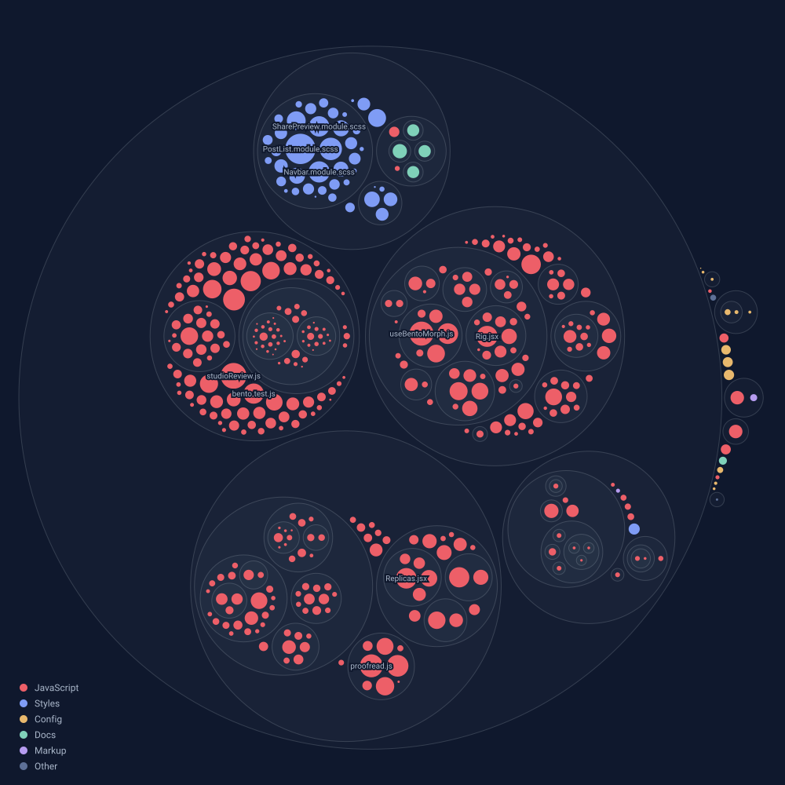

<p >
&nbsp;
&nbsp;
</p>

# Ruben-P

My personal website and portfolio, where I put my work as a developer and creative.

## Why?

It started life in 2021, and rather than let it sit, I've kept building on it since. It's now my portfolio, and the place I try out ideas I want to get better at, from 3D scenes to motion to the small details that make a site feel right.

Everything on it comes from a CMS, so adding new work is writing, not code.

## How it's built

- **[Next.js](https://nextjs.org)** on **[Vercel](https://vercel.com)**
- **[Sanity](https://www.sanity.io)** for content, with the Studio built into the site at `/admin` and live preview while editing
- **[Cloudinary](https://cloudinary.com)** for every image, video and 3D model
- **[three.js](https://threejs.org)** through react-three-fiber for the 3D scenes
- **[Bun](https://bun.sh)** to install, run and test

## Access

The website is publicly deployed:

- ### [Production Site](https://www.ruben-p.com)&nbsp; <picture></picture>

- ### [Dev Site](https://www.beta.ruben-p.com)&nbsp; <picture></picture>

## Setup

```bash
bun install
cp .env.example .env.local # then fill it in
bun dev # site on localhost:3000, Studio at /admin
bun test
```

## The codebase at a glance

Redrawn by a GitHub Action on every push to master.


